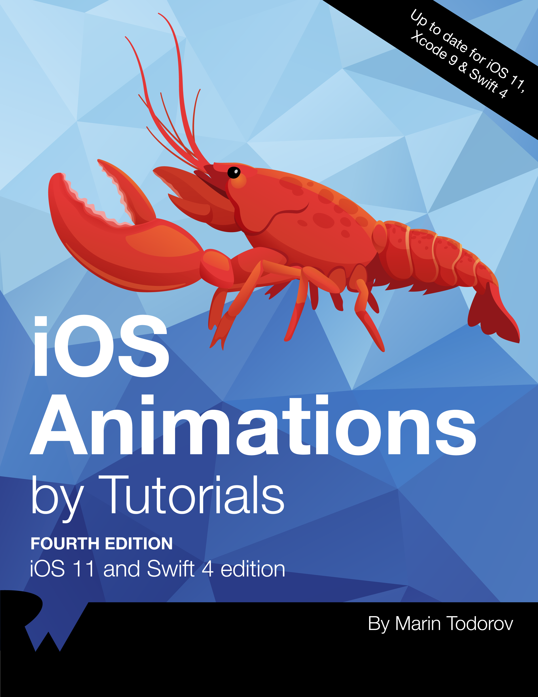

# Mash up 4기 iOS_Animation 스터디

## 스터디 진행
* 챕터별 리뷰 진행
* 전체 내용을 훑는 방식이 아닌 챕터별로 중요한 내용이나 몰랐던 내용, 공유하고 싶은 내용 자유롭게 토론식 진행
* Challenge 코드 공유
* 예제 프로젝트 코드 공유 (리팩토링까지 진행한 멤버에 한해서)

## 교재
* iOS Animations by Tutorials 

## 과제
* 챕터당 내용 요약 정리
* 챕터당 예제 프로젝트 + Challenge 실습
* 위 2개를 진행 후 개인 Repository 또는 Mash-up Repository에 스터디 전까지 Commit

## 커리큘럼
#### 1주차 : 오리엔테이션
#### 2주차 : 챕터 1, 2, 3
#### 3주차 : 챕터 4, 5, 6
#### 4주차 : 챕터 7, 8, 9
#### 5주차 : 챕터 10, 11, 12
#### 6주차 : 챕터 13, 14, 15
#### 7주차 : 챕터 16, 17, 18
#### 8주차 : 챕터 19, 20, 21
#### 9주차 : 챕터 22, 23, 24
#### 10주차 : 챕터 25, 26, 27